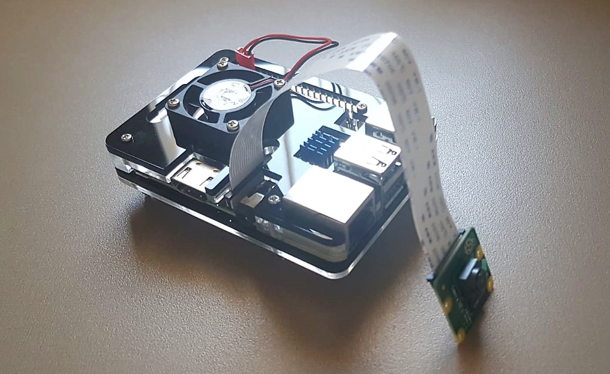

# Live motion detection and face recognition for any Door
## Raspberry PI project

A Raspberry PI project.

You are placing the raspberry pi on the door.

Analyze video feed -
* detect motion
* recognize faces
* log all the information

## Detect motion

Subtracting grayscaled frame sequence results with white pixel image contains the pixel difference between those frames.

by blurring the pixels with gaussian blur and thresholding the substracted image, we isolate the moving object.

the area of the white pixels is the amount of change between the frames.

giving a minimum area set for general "noises" I've managed to recognize the movement of human.

## Recognize

You are setting data of familiar people's pictures.

the code will load those picture, encode their face details.

on movement detection, the code will try to recognize faces on the frame.

once a face recognized it would compare to the given data.

and print the log of the output.

## Scale
* Adding speakers, can set a barking noise to play when a movement detected to pretend a dog is in the house.
  or implementing your voice, to output wanted sentence.

* send email, or stream to a 24/7 running computer.

* make the computer to calculate the movement, detection and recognized people.
**But** This makes the project dependent on the computer.
